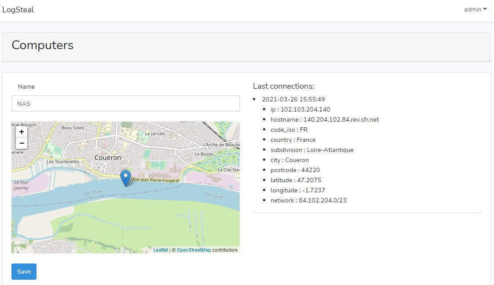

# Logsteal

 LogSteal is a tool for checking informations about an ip address.
 
 You add on your device (computer , phone...) a call to this website, then 
 you will get an email each month with the detail of the connections. 
 
 If your device is stolen, you can go to the police with a list of informations 
 like the ip address, the hostname... 
 You can also track informations on Google Analytics.
 
 # Installation
 
 git clone git@github.com:ynizon/logsteal.git
 
 Copy .env.example into .env 
 Set .env variables
 Set your admin account into database/seeds/UsersTableSeeder.php
 (default = admin@admin.com / admin)
 
 Launch the command to create sqlite Database
 php artisan migrate --seeds

# Settings

First add a device into your account. Logsteal will give you a url like :
https://yourwebsite.com/log/123456
When you access to this url, the website will show all details 
informations about the connection and keep them into the database.
You can now access like this:

You can also set this url https://yourwebsite.com/ping/123456
This url is the same than the other, but redirect to google without
showing any informations.

Personaly, i have added on my phone startup a HTTP request to the url
with Tasker (Android): https://play.google.com/store/apps/details?id=net.dinglisch.android.taskerm&hl=fr&gl=US

On my windows computer, i have also added a batch file with 
wget : http://gnuwin32.sourceforge.net/packages/wget.htm
